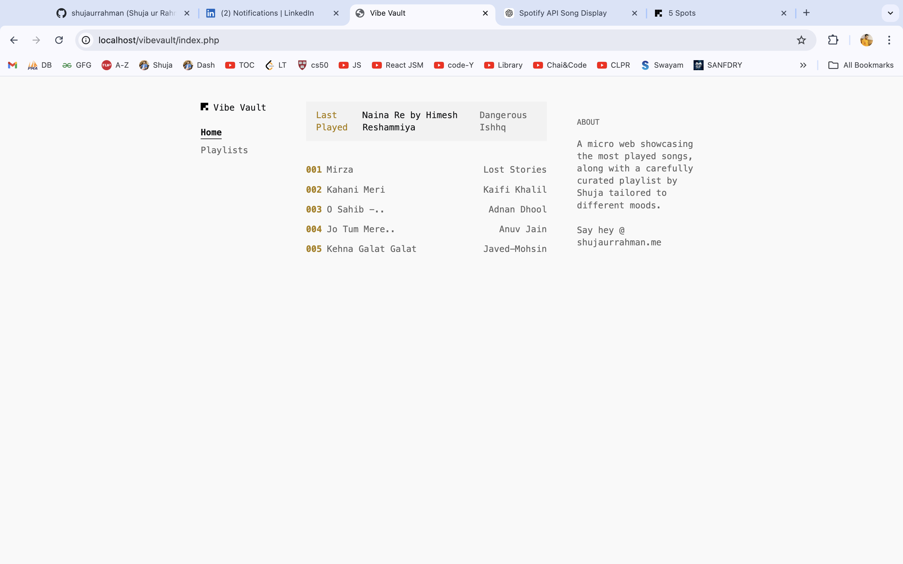

# VibeVault 🎶

VibeVault is a Spotify integration project that fetches a user's currently playing track, most played tracks, and provides basic playlist interactions using Spotify's Web API. This project allows you to authenticate users via Spotify, retrieve access tokens, and handle their Spotify data for a personalized music experience.



## Table of Contents

- [Project Description](#project-description)
- [Project Structure](#project-structure)
- [Features](#features)
- [Screenshots](#screenshots)
- [Installation and Setup](#installation-and-setup)
- [How It Works](#how-it-works)
- [Future Enhancements](#future-enhancements)

---

## Project Description

VibeVault is a web-based application that connects to Spotify's API to retrieve and display the user's music data. It uses OAuth2 for authentication, allowing users to log in via Spotify and access features like:
- Viewing the currently playing track or recently played track.
- Fetching the user's top tracks.
- Displaying personalized playlist data.

The project is built using PHP and requires Composer for dependency management (Dotenv for environment variables). This project helps in understanding how to use OAuth with APIs and manage tokens securely.

---

## Project Structure

The project has the following file structure:

```
/vibevault
    ├── /includes
    │   ├── auth.php              # Handles Spotify OAuth flow 
    │   └── spotifyHandler.php    # functions for accessing Spotify API
    index.php                     # Main file
    access.php                    # handling the OAuth callback
    style-vibe.css                # styling file for UI
    tokens.json                   # Stores access token and refresh token.
composer.json                     # Composer dependencies (dotenv)
```

### Key Files
- **index.php**: The main page where user data, such as the currently playing track or top tracks, is displayed.
- **access.php**: Handles Spotify OAuth callback logic and stores the tokens in `tokens.json`.
- **auth.php**: Handles the Spotify authorization logic and redirects users to Spotify for authentication.
- **spotifyHandler.php**: Includes functions to interact with the Spotify API for fetching track information.

---

## Features
- OAuth2 authentication with Spotify.
- Fetch and display currently playing track or recently played track.
- Retrieve and display the user's top tracks.
- User-friendly interface with a simple layout.

---

## Screenshots


*Displaying currently playing track*


*User's top tracks*

---

## Installation and Setup

To set up VibeVault locally, follow these steps:

1. **Clone the repository:**
   ```bash
   git clone https://github.com/shujaurrahman/Vibe-vault.git
   cd vibevault
   ```

2. **Install Composer dependencies:**
   Make sure you have Composer installed. Then run:
   ```bash
   composer install
   ```

3. **Create environment files:**
   - Create a `.env` file in the `/includes` directory and specify your Spotify credentials:
     ```env
     SPOTIFY_CLIENT_ID=your_client_id
     SPOTIFY_CLIENT_SECRET=your_client_secret
     SPOTIFY_REDIRECT_URI=http://yourdomain.com/access.php
     ```

4. **Create the `tokens.json` file:**
   - This file will store your access token and refresh token. Make sure it's writable by your server.

5. **Run the application:**
   - Open `index.php` in your web browser. You should be prompted to log in via Spotify.

---

## How It Works

1. **User Authentication:**
   - The user clicks a login button, which redirects them to the Spotify authorization page. After logging in, Spotify redirects them back to `access.php` with a code.

2. **Token Exchange:**
   - `access.php` uses this code to request an access token and refresh token from Spotify and stores them in `tokens.json`.

3. **Data Fetching:**
   - Using the access token, the application can now make requests to the Spotify API to fetch data such as the currently playing track and the user's top tracks, which are displayed on `index.php`.

---

## Future Enhancements

- Implement additional Spotify API features such as creating playlists or adding/removing tracks.
- Improve the user interface with modern frameworks like React or Vue.js for a more dynamic experience.
- Enhance error handling and token expiration management for better user experience.

---
